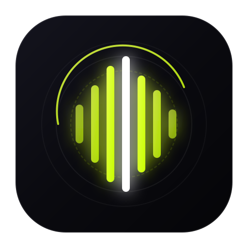

<p align="center">
  
</p>

<h1 align="center">NODAYSIDLE Sonora</h1>

<p align="center">
  <strong>Universal native desktop music player uniting Spotify, YouTube Music, and Local files.</strong><br>
  Sample-accurate gapless audio, studio-grade EBU R128 loudness normalization, and synced lyrics with real-time romanization.
</p>

<p align="center">
  
  
  
  
  
  
  
  
</p>

<p align="center">
  <a href="https://github.com/nodaysidle/nodaysidle-sonora/releases/download/v0.1.0/Sonora_0.1.0_aarch64.dmg"><strong>Download macOS DMG (v0.1.0)</strong></a>
  ·
  <a href="https://github.com/nodaysidle/nodaysidle-sonora/releases/download/v0.1.0/Sonora_0.1.0_amd64.AppImage"><strong>Download Linux AppImage (v0.1.0)</strong></a>
  ·
  <a href="https://github.com/nodaysidle/nodaysidle-sonora/releases">All Releases</a>
</p>

<p align="center">
  <em>Apple Silicon macOS (.dmg) · Linux (.deb & .AppImage via GitHub Actions release workflow) · Zero Electron overhead</em>
</p>

<p align="center">
  <a href="#why-sonora">Why Sonora</a> ·
  <a href="#performance">Performance</a> ·
  <a href="#features">Features</a> ·
  <a href="#architecture">Architecture</a> ·
  <a href="#spotify-resolver">Spotify Resolver</a> ·
  <a href="#privacy">Privacy</a> ·
  <a href="#install">Install</a> ·
  <a href="#development">Development</a>
</p>

---

## Why Sonora?

Mainstream music streaming desktop apps have become bloated Chromium web views consuming gigabytes of memory, spawning half a dozen background helper processes, and serving tracking telemetry while locking you into a single proprietary walled garden.

**Sonora** rethinks the desktop music player from the bare metal up:

| Problem in Mainstream Players | How Sonora Solves It |
| :--- | :--- |
| **Bloated Electron shell** (700MB–1.2GB RAM idle) | **Lightweight Tauri v2 + Rust** (<105 MB RAM idle, ~2% CPU) |
| **Jarring volume jumps** between old and modern tracks | **Hardware EBU R128 Loudness Normalization** (-14 LUFS real-time gain stage) |
| **Gaps & clicks** between continuous album tracks | **Double-buffering pre-roll engine** (sample-accurate gapless transitions) |
| **Siloed music libraries** (Local vs. Spotify vs. YouTube) | **Unified Canvas**: Local FLACs, Spotify playlists, and YT Music streams share one queue |
| **Untransliterated foreign lyrics** (Japanese, Korean, etc.) | **Instant Romanization**: Kanji/Kana to Romaji, Hangul to RR, Pinyin, and Cyrillic |
| **Intrusive ads, analytics, telemetry** | **100% Local-First & Zero Telemetry**: Secrets stay in memory or local secure storage |

---

## Performance

Tested and measured live on Apple Silicon macOS (M4, 16GB):

| Metric | Official Spotify Desktop | **Sonora Desktop** |
| :--- | :--- | :--- |
| **Core Architecture** | Heavy Electron / Chromium (6–8 helper processes) | **Tauri v2 + Native Rust + macOS CoreAudio / ALSA** |
| **RAM / Idle Memory** | **~650 MB – 1.2 GB** | **~102 MB** *(~7x–10x lighter)* |
| **CPU Usage (Playback)** | **8.0% – 15.0%** (Chromium rendering + telemetry) | **~2.0%** *(practically idle)* |
| **Process Count** | 6–8 subprocesses | **1 single unified process** |
| **Telemetry & Bloat** | Ads, trackers, background analytics | **Zero telemetry, zero ads, pure local processing** |
| **Audio Normalization** | Proprietary / lossy ReplayGain | **Studio-grade EBU R128 (-14.0 LUFS) real-time gain stage** |

---

## Features

| Area | Capability |
| :--- | :--- |
| **Native Audio Engine** | High-performance audio pipeline using `symphonia` + `cpal`. Decodes FLAC, MP3, AAC, OGG, and Vorbis with lock-free ring buffering. |
| **Deterministic Gapless** | Double-buffering pre-roll mechanism pre-decodes 5 seconds of the upcoming track so transitions have zero audible delay, click, or sample discontinuity. |
| **Loudness Normalization** | Real-time EBU R128 integrated loudness scanning with a smooth floating-point gain stage targeting -14.0 LUFS. |
| **Spotube-Style Resolver** | Spotify PKCE OAuth 2.0 Web API integration for playlists and metadata; audio streams resolved via YouTube Music InnerTube and `yt-dlp` with zero DRM blocks. |
| **Synced Lyrics & Transliteration** | Real-time line-by-line scrolling lyrics from LRCLIB with instant script transliteration (Japanese Romaji via Lindera IPADIC, Korean RR, Pinyin, Cyrillic). |
| **3-Way Lyrics View** | Switch between `Original`, `Romanized`, or `Dual (Original + Romanized side-by-side)`. |
| **Local SQLite & FTS5** | Scans recursive music folders with `lofty`, extracts embedded artwork, and indexes tags into SQLite with FTS5 instant full-text search. |
| **Glassmorphic UI** | Clean dark-mode interface built with React 19 and Tailwind CSS, featuring native macOS Liquid Glass vibrancy and dynamic artwork glow themes. |
| **Cross-Platform Delivery** | Native `.dmg` for macOS Apple Silicon and automated GitHub Actions CI generating `.AppImage` and `.deb` for Linux. |

---

## Architecture

```
+---------------------------------------------------------------------------------------+
|                                    SONORA CLIENT                                      |
|                                                                                       |
|  [ Local Audio Files ]       [ Spotify Library & Playlists ]    [ YouTube Music API ] |
|   (FLAC, MP3, AAC, OGG)       (PKCE OAuth 2.0 Web API)          (InnerTube / yt-dlp)  |
|            |                                |                              |          |
|            |               Stream Resolver (Spotube-style)                 |          |
|            |               Artist + Title + Duration Match                 |          |
|            |                                |                              |          |
|            v                                v                              v          |
|     +---------------------------------------------------------------------------+     |
|     |                       RUST BACKEND: AUDIO ENGINE                          |     |
|     |                                                                           |     |
|     |  1. Symphonia Audio Decoder (Vorbis, FLAC, MP3, AAC, Opus)               |     |
|     |  2. Sample Rate Converter & Channel Downmix                               |     |
|     |  3. Lock-Free ArrayQueue Ring Buffer (4 seconds capacity)                 |     |
|     |  4. Double-Buffering Pre-Roll (5s pre-roll for sample-accurate gapless)   |     |
|     |  5. EBU R128 Loudness Normalization Stage (-14.0 LUFS Target)             |     |
|     |  6. CPAL Realtime Output Thread -> macOS CoreAudio / Linux ALSA           |     |
|     +---------------------------------------------------------------------------+     |
|                                         |                                             |
|                                  Audio Output                                         |
|                                         v                                             |
|                               [ Studio Monitors /                                     |
|                                  Headphones Out ]                                     |
+---------------------------------------------------------------------------------------+
```

---

## Spotify Resolver

Spotify does not expose decrypted audio streams to third-party clients and restricts raw DRM keys. Sonora adopts the proven **Spotube architecture**:
1. Connects directly to your **personal Spotify Developer Client ID** via PKCE OAuth 2.0.
2. Synchronizes your real Spotify playlists, saved albums, liked songs, and library metadata with zero rate limits.
3. When you play a track, Sonora matches the song by `Artist + Title + Duration` against high-bitrate YouTube Music audio streams via InnerTube and `yt-dlp`.
4. Decodes the stream directly in Rust with native hardware acceleration, bypassing Electron overhead and DRM restrictions.

---

## Privacy

Sonora is local-first by design:
- **Zero accounts, zero trackers**: No Sonora login, telemetry, or behavioral tracking.
- **Direct provider connection**: OAuth tokens and API calls communicate directly between your machine and Spotify/YouTube/LRCLIB.
- **Local database**: Library metadata and search indices reside strictly on your local filesystem in SQLite.

---

## Install

### macOS (Apple Silicon M-Series)
1. Download the latest **[`Sonora_0.1.0_aarch64.dmg`](https://github.com/nodaysidle/nodaysidle-sonora/releases/download/v0.1.0/Sonora_0.1.0_aarch64.dmg)** from GitHub Releases.
2. Open the `.dmg` and drag `Sonora.app` into `/Applications`.
3. If macOS displays an unnotarized developer notice on first open, right-click `Sonora.app` and choose **Open**, or run:
   ```bash
   xattr -cr /Applications/Sonora.app
   ```

### Linux (AppImage & .deb)
Linux builds (`.AppImage` and `.deb`) are produced automatically by the repository's GitHub Actions CI on every release tag.
1. Download `Sonora_0.1.0_amd64.AppImage` or `sonora_0.1.0_amd64.deb` from [Releases](https://github.com/nodaysidle/nodaysidle-sonora/releases).
2. For AppImage:
   ```bash
   chmod +x Sonora_*.AppImage
   ./Sonora_*.AppImage
   ```
3. For Debian / Ubuntu:
   ```bash
   sudo dpkg -i sonora_*_amd64.deb
   ```

---

## Development

### Prerequisites
- macOS 13+ or modern Linux (Ubuntu 22.04+)
- [Node.js](https://nodejs.org/) (v20+)
- [Rust](https://www.rust-lang.org/) (1.78+)
- [yt-dlp](https://github.com/yt-dlp/yt-dlp) (`brew install yt-dlp` or `sudo apt install yt-dlp`)

### Run Locally
```bash
# Clone the repository
git clone https://github.com/nodaysidle/nodaysidle-sonora.git
cd nodaysidle-sonora

# Install frontend dependencies
npm install

# Run native desktop app in development mode
npm run tauri dev
```

### Build from Source
```bash
# Compile optimized release binary & bundle
npm run tauri build

# macOS: Install to /Applications
cp -R src-tauri/target/release/bundle/macos/Sonora.app /Applications/
```

---

## Project Structure

```
nodaysidle-sonora/
├── src/                               # Frontend (React 19 + TypeScript + Tailwind)
│   ├── components/
│   │   ├── layout/                    # Window Shell, Header, Centered Title
│   │   ├── sidebar/                   # Navigation & Source Switcher
│   │   ├── player/                    # Transport bar, Scrubber, Volume
│   │   ├── library/                   # Tracks, Albums, Artists, Playlists
│   │   └── lyrics/                    # SyncedLyricsView & Romanization toggle
│   ├── services/
│   │   ├── tauriBridge.ts             # Typed IPC bridge to Rust backend
│   │   ├── lyricsService.ts           # LRCLIB fetcher & parser
│   │   └── romanization.ts            # Text transliteration helpers
│   └── stores/
│       ├── playerStore.ts             # Unified audio player Zustand state
│       └── libraryStore.ts            # Track catalogue and search state
├── src-tauri/                         # Backend (Rust + Tauri v2)
│   ├── src/
│   │   ├── audio/
│   │   │   ├── engine.rs              # Symphonia + CPAL gapless audio engine
│   │   │   └── normalization.rs       # EBU R128 integrated loudness gain stage
│   │   ├── db/                        # SQLite connection pool & FTS5 migrations
│   │   ├── library/                   # Recursive music scanner using lofty
│   │   ├── lyrics/                    # Romanization engine (Lindera IPADIC)
│   │   ├── providers/
│   │   │   ├── spotify.rs             # Spotify PKCE OAuth & Web API
│   │   │   └── ytmusic.rs             # InnerTube & yt-dlp stream resolver
│   │   └── lib.rs                     # Tauri IPC command registration
│   └── Cargo.toml                     # Rust dependencies
├── .github/
│   └── workflows/
│       └── release.yml                # Automated macOS DMG & Linux AppImage/deb CI
├── package.json
└── README.md
```

---

## License

MIT © [NODAYSIDLE](https://github.com/nodaysidle)
